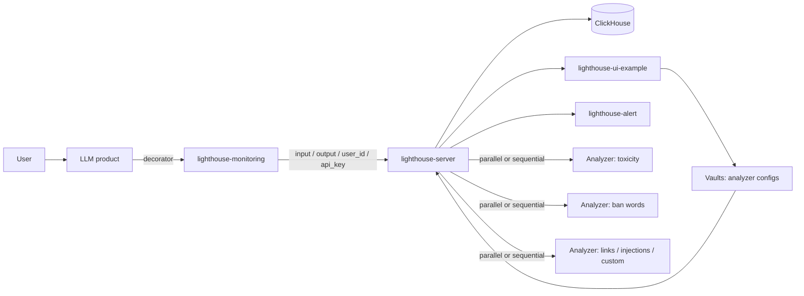

<div align="center">

# LightHouse

### Online monitoring layer for LLM products

LightHouse — модульная платформа для мониторинга нежелательных сценариев в LLM-продуктах: токсичный контент, prompt leakage, jailbreak/injection-паттерны, запрещённые слова, подозрительные ссылки и другие policy violations.

[](#)
[](#)
[](#)
[](#)

</div>

---

## What is LightHouse?

LightHouse помогает владельцам LLM-продуктов наблюдать за тем, что происходит на входе и выходе модели, подключать независимые анализаторы и управлять режимом мониторинга без изменений в коде продукта.

Главная идея: **LLM-продукт должен интегрировать мониторинг один раз, а дальше команда может добавлять, отключать и настраивать анализаторы на стороне LightHouse**.

Система поддерживает два режима работы:

| Режим                 | Как работает                                                                                                                       | Когда использовать                                                                        |
| --------------------- | ---------------------------------------------------------------------------------------------------------------------------------- | ----------------------------------------------------------------------------------------- |
| **Parallel / async**  | Ответ LLM отдаётся пользователю сразу, анализаторы выполняются параллельно и не задерживают основной user flow.                    | Для фонового мониторинга, аналитики, сбора метрик и поиска негативных кейсов.             |
| **Sequential / sync** | Ответ отдаётся только после прохождения всех проверок. Если проверка не пройдена, продукт может вернуть безопасный fallback-ответ. | Для production-gate режима, когда важно не пропускать токсичный или небезопасный контент. |

---

## Why it matters

LLM-продукты быстро начинают сталкиваться с негативными сценариями:

* токсичные ответы модели или токсичные пользовательские сообщения;
* утечки системного промпта и защищённых параметров;
* jailbreak и prompt injection атаки;
* запрещённые слова, ссылки, кодовые последовательности и другие rule-based нарушения;
* отсутствие единого места, где можно посмотреть метрики, конкретные негативные кейсы и интерпретацию срабатывания.

LightHouse закрывает это как отдельный monitoring layer: его можно поставить рядом с любым LLM-продуктом, подключить через Python decorator и дальше расширять новыми анализаторами.

---

## High-level architecture



### Data flow

1. В LLM-продукт добавляется decorator из `lighthouse-monitoring`.
2. Decorator передаёт в LightHouse вход пользователя, ответ модели, `user_id`, `api_key` и metadata.
3. `lighthouse-server` определяет продукт, активные анализаторы и текущий режим мониторинга.
4. Анализаторы проверяют input и/или output через собственные endpoints.
5. Результаты проверок, метрики, reject flags и интерпретации сохраняются и отображаются в UI.
6. Режим мониторинга можно переключать онлайн без изменений в коде LLM-продукта.

---

## Repositories

| Repository                                                                      | Role in the system                                                                                                                                                              |
| ------------------------------------------------------------------------------- | ------------------------------------------------------------------------------------------------------------------------------------------------------------------------------- |
| [`lighthouse-server`](https://github.com/analab-team/lighthouse-server)         | Core service. Принимает события из SDK, управляет продуктами, анализаторами, Vaults, режимами мониторинга, сохраняет данные и оркестрирует проверки в parallel/sequential mode. |
| [`lighthouse-monitoring`](https://github.com/analab-team/lighthouse-monitoring) | Python package с decorator-based интеграцией. Позволяет быстро обернуть функцию или метод, где вызывается LLM, и отправлять input/output в LightHouse.                          |
| [`lighthouse-ui-example`](https://github.com/analab-team/lighthouse-ui-example) | Примеры UI-страниц для администратора и пользователя: настройка мониторинга, Vaults, просмотр метрик и негативных кейсов.                                                       |
| [`analyzer_example`](https://github.com/analab-team/analyzer_example)           | Reference template для нового анализатора. Показывает структуру сервиса, Vault-модель, endpoints для input/output проверок и docker deployment.                                 |
| [`no_llm_analyzers`](https://github.com/analab-team/no_llm_analyzers)           | Набор deterministic/rule-based анализаторов без LLM: ban words, links, base64, sequence match, SQL injection, XSS, word match и другие проверки.                                |
| [`toxic_analyzers`](https://github.com/analab-team/toxic_analyzers)             | Анализаторы токсичности для оценки опасного, оскорбительного или ненормативного контента.                                                                                       |
| [`lighthouse-alert`](https://github.com/analab-team/lighthouse-alert)           | Alerting bot prototype для уведомлений по приложениям и негативным событиям.                                                                                                    |

---

## Core concepts

### Product

Product — конкретный LLM-продукт или агент, который подключается к LightHouse. Для продукта создаётся `api_key`, через который SDK отправляет события в сервер.

### Analyzer

Analyzer — независимый сервис проверки. Каждый анализатор может проверять:

* **input**: сообщение пользователя до вызова модели;
* **output**: ответ модели перед отдачей пользователю;
* **input + output**: сценарии, где важно сравнивать запрос и ответ.

Анализаторы можно добавлять, удалять и обновлять без изменения кода LLM-продукта.

### Vault

Vault — конфигурация анализатора для конкретного продукта. Там могут храниться:

* ban words и policy rules;
* системный промпт, который не должен утекать в ответе модели;
* пороги классификаторов;
* даты, регулярные выражения и другие параметры проверки.

### Interpretation

Analyzer может возвращать не только `reject_flg`, но и интерпретацию: какие слова, ссылки, паттерны или части текста привели к срабатыванию. Это делает мониторинг полезным не только для блокировки, но и для анализа негативных кейсов.

---

## Quick start

### 1. Start LightHouse Server

```bash
git clone https://github.com/analab-team/lighthouse-server.git
cd lighthouse-server
cp .env.example .env
```

Заполните `.env`, затем поднимите сервис:

```bash
source docker/deploy.sh up --all
```

Если ClickHouse уже поднят отдельно, можно запустить только приложение:

```bash
source docker/deploy.sh up --app
```

### 2. Start analyzers

Для примера можно поднять reference analyzer:

```bash
git clone https://github.com/analab-team/analyzer_example.git
cd analyzer_example
cp .env.example .env
source docker/deploy.sh up
```

После запуска добавьте анализатор в основной сервис:

```text
/admin/add_analyzer
```

### 3. Create product and Vaults

Администратор создаёт продукт и выдаёт `api_key`:

```text
/admin/add_product
```

Для каждого подключённого анализатора нужно заполнить Vault:

```text
/vault/add
```

Vault обязателен, потому что именно в нём лежат настройки анализатора для конкретного продукта.

### 4. Add monitoring to your LLM product

```bash
pip install lighthouse-monitoring
```

```python
import os
from lighthouse_monitoring import LightHouseHandler

@LightHouseHandler(
    input_param_name="user_input",
    user_id_param_name="user_id",
    api_key=os.environ["LH_API_KEY"],
    address=os.environ["LH_SERVER_URL"],
)
async def llm_process(user_id: str, user_input: str) -> str:
    output = await model(user_input)
    return output
```

После этого LightHouse будет получать входы пользователей и ответы модели, запускать анализаторы и сохранять результаты мониторинга.

### 5. Switch monitoring mode online

Режим можно поменять без релиза LLM-продукта:

```text
/monitoring/change_mode
```

Это позволяет быстро перейти из фонового мониторинга в strict gate mode, если обнаружена атака, волна токсичных запросов или другой рискованный сценарий.

---

## Analyzer interface

Новый анализатор удобно создавать на базе [`analyzer_example`](https://github.com/analab-team/analyzer_example).

Базовый контракт:

```text
/analyzer/input
/analyzer/output
```

Обычно анализатор реализует:

* Vault schema — какие параметры нужны анализатору;
* model/service logic — как считать score, reject flag и interpretation;
* input/output handlers — какие тексты анализировать;
* docker deployment — чтобы анализатор можно было быстро подключить к `lighthouse-server`.

Минимальная идея ответа анализатора:

```json
{
  "reject_flg": true,
  "metrics": {
    "toxicity": 0.91
  },
  "interpretation": "Triggered by toxic phrase: ..."
}
```

---

## Current analyzer directions

LightHouse уже покрывает несколько классов проверок:

* **Toxicity** — оценка токсичности, опасности, оскорблений и ненормативного контента.
* **Ban words / word match** — поиск запрещённых слов и выражений.
* **Link analyzer** — проверка входных ссылок.
* **Sequence match** — поиск запрещённых последовательностей или похожих фрагментов.
* **Base64 / encoded patterns** — детектирование подозрительных encoded payloads.
* **SQL injection / XSS patterns** — rule-based проверки injection-паттернов.
* **Prompt leakage via Vault** — проверка, что защищённые параметры, например системный промпт, не попали в output.

---

## Admin vs Product user

### Admin flow

1. Поднять `lighthouse-server`.
2. Поднять нужные анализаторы.
3. Добавить анализаторы через `/admin/add_analyzer`.
4. Создать продукт через `/admin/add_product`.
5. Выдать пользователю `api_key`.

### Product user flow

1. Получить `api_key`.
2. Заполнить Vault для каждого анализатора.
3. Поставить `lighthouse-monitoring`.
4. Навесить `LightHouseHandler` на LLM-функцию.
5. Смотреть метрики, негативные кейсы и интерпретации в UI.
6. При необходимости переключить режим на sequential через `/monitoring/change_mode`.

---

## Roadmap

* Production-ready alerting flow через Telegram/бота.
* Адаптация jailbreak и prompt injection моделей под русский язык.
* Нагрузочное тестирование на продуктах с большим traffic.
* Повышение fault tolerance анализаторов и основного сервиса.
* Расширение библиотеки анализаторов под новые policy checks.

---

## Built at AI Product Hack

LightHouse был разработан командой **analab** в рамках AI Product Hack от AI Talent Hub.

Проект сфокусирован на простой интеграции, модульной архитектуре и понятной интерпретации результатов мониторинга — чтобы команды могли быстро подключать safety/quality checks к своим LLM-продуктам и управлять рисками без переписывания production-кода.
